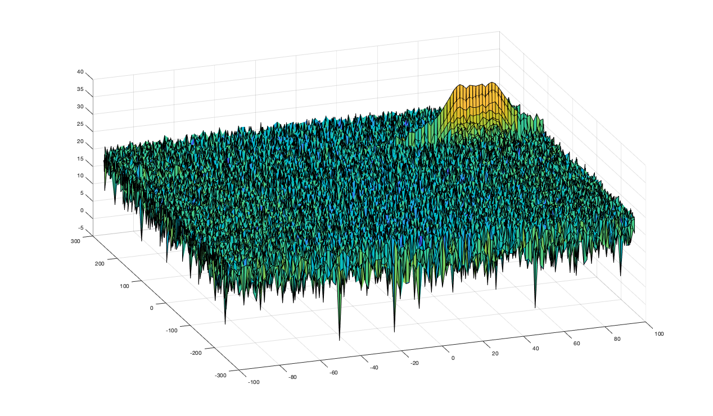
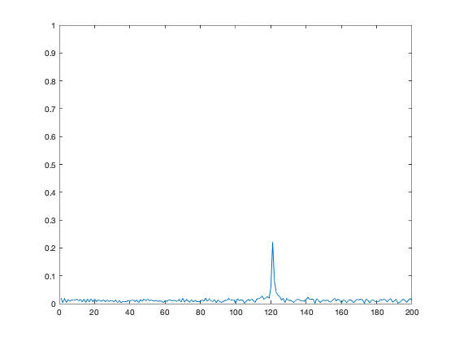

## Radar Target Generation and Detection
Implement 2D CFAR for final project for the Radar section of Udacity Sensor Fusion Nanodegree.


### Implementation steps for the 2D CFAR process
1. Determine the number of Training cells for each dimension Tr and Td. Similarly, pick the number of guard cells Gr and Gd.
2. Slide the Cell Under Test (CUT) across the complete cell matrix
3. Select the grid that includes the training, guard and test cells. Grid Size = (2Tr+2Gr+1)(2Td+2Gd+1).
4. The total number of cells in the guard region and cell under test. (2Gr+1)(2Gd+1).
5. This gives the Training Cells : (2Tr+2Gr+1)(2Td+2Gd+1) - (2Gr+1)(2Gd+1)
6. Measure and average the noise across all the training cells. This gives the threshold
7. Add the offset (if in signal strength in dB) to the threshold to keep the false alarm to the minimum.
8. Determine the signal level at the Cell Under Test.
9. If the CUT signal level is greater than the Threshold, assign a value of 1, else equate it to zero.
10. Since the cell under test are not located at the edges, due to the training cells occupying the edges, we suppress the edges to zero. Any cell value that is neither 1 nor a 0, assign it a zero.

### Selection of Training, Guard, and offset
Observe that the provided Range-Doppler Map has a higher noise variance in the doppler axis than the range axis. This means we should use a larger amount of training and guard cells in the doppler dimension. I solely chose the offset value (in dB) based on the desired thresholded response. The final values I chose were:
```
Tr = 12;
Td = 28;
Gr = 4;
Gd = 8;
offset = 15.5;
```

### Steps taken to suppress the non-thresholded cells at the edges
I initialized the thresholded response to zeros and chose the indexing such that the edges were never updated. Thus, the edges where we cannot evaluate the CUT are all set to 0s.

## Write up
The starting range-doppler map is below. The initial range was set to `120 m` and initial velocity was set to `70 m/s`.


### FMCW Waveform Design
Using the given system requirements, the Bandwidth `B`, chirp time `Tchirp`, the slope of the chirp was found to be `2.0455e+13`.

### Simulation Loop
The beat signal was implemented, and the next part verifies that the 1D FFT result is within error margin of +/- 10 meters.

### Range FFT (1st FFT)
The range FFT was implemented on the beat or mixed signal. For an initial range of 120 meters, the result of the 1D range FFT is plotted below:


### 2D CFAR
2D CFAR is implemented on the output of the 2D FFT (Range-Doppler map). Notice that the noise is supressed and target signal remains:
